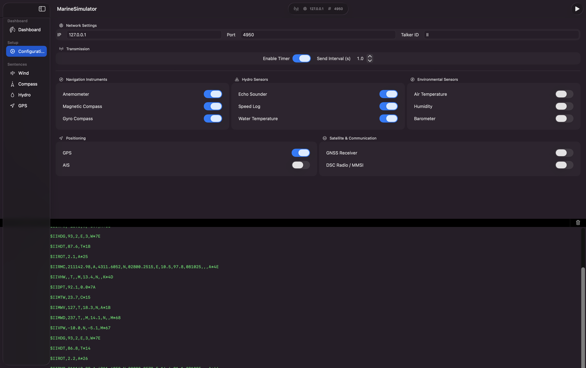

# MarineSimulator

MarineSimulator is a macOS SwiftUI app for simulating marine instrument data and transmitting NMEA 0183 output to external navigation software over IP.

It is built as a practical bench tool: something you can run beside a charting or instrument app, drive with believable values, and use to inspect exactly what is being sent.

## What It Does

- Simulates common onboard data sources:
  - wind
  - heading
  - hydro / speed / depth / water temperature
  - GPS position and motion
- Transmits NMEA 0183 over:
  - UDP
  - TCP
- Supports multiple output endpoints at the same time
- Provides a map-first dashboard for live control and monitoring
- Shows raw NMEA output and transport diagnostics in an in-app console drawer
- Persists the last-used simulator state for faster repeated testing

## Current Dashboard

The current dashboard is centered around a live map with overlay tooling:

- top command bar for panel toggles and presets
- leading control rail for live simulator adjustments
- trailing instrument rail for live values and sentence enable/disable pills
- bottom console drawer for `NMEA` and `Transport` views

The console drawer includes timestamps for NMEA lines and can be collapsed or expanded during testing.

## UI and design approach

The app is built **primarily in SwiftUI** and is intended to stay aligned with **Apple Human Interface Guidelines** and **Swift API Design Guidelines**: standard SwiftUI controls and materials, clear hierarchy, and accessibility-friendly labels where it matters.

Prefer **SwiftUI components** for new and refactored UI. Use **AppKit** or **`NSViewRepresentable`** only when SwiftUI does not reasonably expose the capability or when a **first-party** view owns the feature (for example, MapKit on the dashboard). Keep any bridge small and intentional.

## Current Capabilities

- Coherent snapshot-based simulation tick
- Sentence-level scheduling with configurable intervals
- Sensor toggles versus sentence toggles
- Sensor interlocks in dashboard controls
- Gyro-priority heading behavior when both gyro and magnetic heading exist
- Transport diagnostics and event history
- Fault injection for:
  - dropped sentences
  - delayed sentences
  - corrupted checksums
  - invalid data/status mutations
- Named presets for repeatable setups
- Auto-restored live values between launches

## Screenshots

### Dashboard

### Configuration

### Sentence Setup

## NMEA Coverage

Current implemented sentence families include:

- Wind
  - `MWV`
  - `MWD`
  - `VPW`
- Heading
  - `HDG`
  - `HDT`
  - `ROT`
- GPS
  - `RMC`
  - `GGA`
  - `VTG`
  - `GLL`
  - `GSA`
  - `GSV`
  - `ZDA`
- Hydro
  - `DBT`
  - `DPT`
  - `MTW`
  - `VHW`
  - `VBW`
  - `VLW`

## Testing Focus

The current engineering priority is external-reader interoperability, not feature expansion for its own sake.

The next validation step is to run the manual checklist against the target reader and confirm:

- wind sentence interpretation
- heading and course agreement
- GPS sentence acceptance
- UDP and TCP endpoint behavior
- fault-handling behavior in the receiver

## Project Docs

User-facing project docs live in:

- [`Docs/ProjectOverview.md`](Docs/ProjectOverview.md)
- [`Docs/CurrentTasks.md`](Docs/CurrentTasks.md)
- [`Docs/CompletedTasks.md`](Docs/CompletedTasks.md)
- [`Docs/InstructionManual.md`](Docs/InstructionManual.md)
- [`Docs/ManualTestChecklist.md`](Docs/ManualTestChecklist.md)

## Getting Started

### Requirements

- macOS
- Xcode

### Run

1. Clone the repository.
2. Open `MarineSimulator.xcodeproj` in Xcode.
3. Select `My Mac`.
4. Build and run.

## Current Limitations

- Sentence fidelity still needs more edge-case validation against real external readers
- Some sentence implementations are still intentionally conservative or simplified
- UI automation is still limited
- NMEA 2000 is not implemented
- Environment-driven realism such as live weather/current ingestion is not implemented

## Roadmap Direction

Near-term priority:

1. prove compatibility against the external reader
2. fix any mismatches found there
3. lock those fixes down with targeted regression tests

Longer-term direction:

- richer realism
- more protocol depth
- read/ingest mode
- broader transport and device interoperability

## Author

Vasil Borisov

- GitHub: [bacataBorisov](https://github.com/bacataBorisov)
- Email: [vasil.borisovv@gmail.com](mailto:vasil.borisovv@gmail.com)
